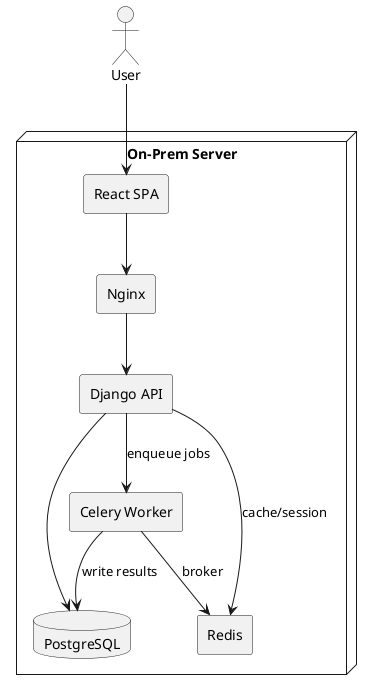

# SPEC-1-Drilling Campaign Tracker

## Background

Operations teams need a lightweight system to plan and monitor drilling campaigns (rigs, wells, campaigns) with a grid-like UI similar to Google Sheets, visualize timelines as a Gantt chart, and run engineering calculations in Python. Current workflows rely on spreadsheets and manual updates, which are error-prone and lack auditability and role-based access. The target user base is 10–30 internal users, managing up to 5 rigs and ~40 wells. Hosting will be strictly on-premises due to data sensitivity.

## Requirements

**Must Have (M)**

- (M) Spreadsheet-like web UI to CRUD rigs, wells, campaigns with inline editing and sorting/filtering.

- (M) Gantt chart for campaign schedules (rigs → wells), with drag/resize and dependency display.

- (M) Python-based calculation engine for schedule metrics (NPT, rig utilization, cost/day, ETA) triggerable from UI.

- (M) User auth + basic roles (Viewer, Editor, Admin).

- (M) Import/export CSV/Excel to interoperate with existing sheets.

- (M) Audit trail of edits (who/when/what).


**Should Have (S)**

- (S) Scenario versions (draft vs approved) and ability to clone scenarios.

- (S) Comments/annotations on rows and Gantt items.

- (S) Simple API to trigger calculations and fetch results.


**Could Have (C)**

- (C) Multi-rig resource leveling suggestions.

- (C) Notifications (email) for schedule changes.

- (C) Basic cost dashboards.


**Won’t Have (W) (for MVP)**

- (W) Complex geoscience modeling.

- (W) Real-time rig telemetry ingestion.

- (W) Enterprise SSO (can be added later).


## Method

### High-level Architecture (On‑Prem)

- **Frontend**: React SPA served by Nginx; UI uses **AG Grid (Community)** for sheet-like editing and **vis-timeline** for the Gantt.

- **Backend**: **Django 5.2 (LTS)** + **Django REST Framework** for APIs; built-in auth/permissions.

- **Calc Engine**: Python modules. For long-running jobs, **Celery 5.5** workers with **Redis** broker; for quick calcs, synchronous endpoints.

- **Database**: **PostgreSQL 16+**.

- **Message broker/cache**: **Redis 7/8** on-prem.

- **Reverse proxy**: **Nginx** (TLS termination, static file serving, SPA routing).

- **Packaging**: Docker Compose (on-prem) or native systemd services if Docker is not allowed.


> Scale target: 10–30 users, 5 rigs, 40 wells — fits comfortably on a single VM (8 vCPU / 16 GB RAM / 100 GB SSD) with room to grow.

### Component Diagram (PlantUML)



### Data Model (ERD & Schemas)

```plantuml
@startuml
entity User { id: UUID PK
 email: str unique
 role: enum(Viewer,Editor,Admin)
 created_at }
entity Rig { id: UUID PK
 name: str unique
 day_rate: numeric
 status: enum(Active,Standby,Maintenance) }
entity Well { id: UUID PK
 name: str unique
 field: str
 type: enum(Exploration,Development) }
entity Campaign { id: UUID PK
 name: str unique
 start_date: date
 end_date: date
 scenario_id: UUID FK }
entity Scenario { id: UUID PK
 name: str
 status: enum(Draft,Approved,Archived)
 created_by: UUID FK(User)
 created_at }
entity CampaignWell { id: UUID PK
 campaign_id: UUID FK
 well_id: UUID FK
 rig_id: UUID FK
 planned_start: date
 planned_end: date
 actual_start: date?
 actual_end: date?
 dependencies: jsonb }
entity CalcRun { id: UUID PK
 scenario_id: UUID FK
 status: enum(Pending,Running,Success,Failed)
 params: jsonb
 results: jsonb
 created_by: UUID FK(User)
 created_at
 completed_at? }
entity AuditLog { id: bigserial PK
 user_id: UUID FK
 entity: str
 entity_id: UUID
 action: enum(Create,Update,Delete)
 before: jsonb
 after: jsonb
 at: timestamptz }
User ||--o{ Scenario
Scenario ||--o{ Campaign
Campaign ||--o{ CampaignWell
Rig ||--o{ CampaignWell
Well ||--o{ CampaignWell
Scenario ||--o{ CalcRun
User ||--o{ AuditLog
@enduml
```

**SQL details (PostgreSQL)**

- UUID primary keys (`uuid_generate_v4()`), `jsonb` for flexible fields (dependencies, calc params/results).

- Indexes: `(campaign_id, planned_start)`, GIN on `dependencies`, btree on `name` fields.

- Soft-delete not required for MVP; use hard deletes + AuditLog.


### API Design (DRF)

- `/api/rigs/` `GET/POST`, `/api/rigs/{id}` `GET/PATCH/DELETE`

- `/api/wells/` ... similar

- `/api/scenarios/` ... list/create/clone (`POST /clone`)

- `/api/campaigns/` ... CRUD

- `/api/campaign-wells/` ... CRUD + bulk update

- `/api/gantt/{scenario_id}` `GET` → flattened timeline items

- `/api/calc/run` `POST` → enqueue Celery job; returns `calc_run_id`

- `/api/calc/{calc_run_id}` `GET` → status/results

- `/api/import` `POST` (CSV/Excel), `/api/export` `GET`


### UI Components

- **Sheet View**: AG Grid with column definitions (rig, well, start/end dates, durations, costs). Inline validation, undo/redo, multi-row paste from Excel.

- **Gantt View**: vis-timeline items grouped by rig; drag to adjust dates; dependency lines (custom groups/edges); context menu for add/remove.

- **Scenario Switcher**: dropdown + "Clone scenario" button.

- **Calc Panel**: run calculations, show progress, results (KPIs + downloadable JSON/CSV).


### Calculations (initial set)

- **Duration**: `duration_days = (planned_end - planned_start).days`

- **Rig Utilization** (per rig, date range): `util = productive_days / total_days`

    - `productive_days = sum(duration of CampaignWell with status in {Planned, InProgress, Complete})`

- **NPT (Non-Productive Time)**: user-input or derived from delays; store per CampaignWell; `npt_pct = npt_days / duration_days`

- **Cost**: `rig_cost = rig.day_rate * duration_days`; campaign cost = sum(rig_cost) + extras (jsonb).

- **ETA**: campaign `ETA = max(planned_end)` across wells; include buffers from dependencies.


### Calc Engine Pattern

- Pure Python functions in `/calc` package; deterministic and unit-tested.

- Celery tasks wrap functions for async execution and progress reporting.

- Results persisted in `CalcRun.results` (jsonb) and summarized for UI.


### Authz & Audit

- Roles: `Viewer` (read-only), `Editor` (CRUD except delete scenarios), `Admin` (all).

- DRF permissions enforce role checks per endpoint.

- Every write creates an `AuditLog` entry with before/after snapshots.


### Import/Export

- Parse CSV/Excel (using `pandas` + `openpyxl`).

- Column mapping UI; dry-run mode to preview changes.


### Deployment (On-Prem)

- **Option A: Docker Compose** (`nginx`, `django`, `celery`, `redis`, `postgres`, `frontend` build stage).

- **Option B: Bare-metal/VM**: systemd services for `gunicorn` (Django), `celery`, `nginx`; PostgreSQL & Redis packages.

- Backups: nightly `pg_dump`, weekly base + WAL archiving; Redis persistence disabled (broker only).
