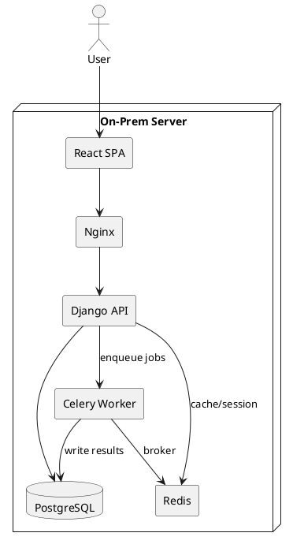

# SPEC-002-Drilling Campaign Tracker

## Background

Operations teams need a lightweight system to plan and monitor drilling campaigns (rigs, wells, campaigns) with a grid-like UI similar to Google Sheets, visualize timelines as a Gantt chart, and run engineering calculations in Python. Current workflows rely on spreadsheets and manual updates, which are error-prone and lack auditability and role-based access. The target user base is 10–30 internal users, managing up to 5 rigs and ~40 wells. Hosting will be strictly on-premises due to data sensitivity.

## Domain Terminology (Glossary)

- **Rig**: jack-up drilling rigs or light workover rigs (LWI). Treated as a scarce, schedule-constrained resource.
- **Platform**: an offshore production oil platform (CPP/WHP/CPP-WHP, etc.).
- **Field**: a collection of platforms and exploration wells within the same asset/area.
- **Well**: either (a) a well on a platform, or (b) an exploration well at an open location (not tied to a platform).
- **Project**: a single job instance (e.g., drill a well on a platform by a rig; plug & abandon an open-location exploration well; platform jobs that may not require a rig; rig-specific jobs like UWILD or 5-year overhaul).
- **Campaign**: a group of projects executed by a **rig** (Rig Campaign), or a sequence of similar jobs on a **field** (Field Operations, e.g., fracturing sequence). Campaigns can **intersect**; a project may belong to zero, one, or multiple campaigns.
- **Maintenance Windows**: platform yearly maintenance periods (shutdowns/turnarounds) that block platform-tied projects during their window; rig-specific events (UWILD, periodic overhauls) block that rig and are modeled as projects.

## Requirements

**Must Have (M)**

- (M) Spreadsheet-like web UI (AG Grid) to CRUD **Fields, Platforms, Wells, Projects, Campaigns** with inline editing, sorting/filtering, and relations (e.g., Platform belongs to Field, Well belongs to Field and optionally Platform).
- (M) Gantt chart of **Projects** with grouping toggle **by Rig / by Platform / by Field**, drag/resize, dependencies, and overlays for **platform Maintenance Windows** and **rig events** (UWILD/overhaul).
- (M) Project model supporting jobs **with or without rigs** (e.g., platform jobs), and rig-specific non-drilling jobs (UWILD/overhaul) that occupy rig time.
- (M) **Campaigns with intersection**: a project can be tagged into **0..N campaigns** (Rig Campaigns, Field Operations). Filtering by campaign(s) in grids and Gantt.
- (M) Python-based calculation engine for schedule metrics (rig utilization excluding maintenance, cost/day, ETA), and **conflict detection** (rig double-booking, platform maintenance clashes, platform/well exclusivity).
- (M) User auth + roles (Viewer, Editor, Admin).
- (M) Import/Export CSV/Excel for Fields, Platforms, Wells, Projects, Campaigns.
- (M) Audit trail of edits (who/when/what).

**Should Have (S)**

- (S) Scenario versions (draft vs approved) and clone.
- (S) Comments/annotations on grid rows, Gantt items, and Projects.
- (S) Simple API to trigger calculations and fetch results.
- (S) Map view for open-location exploration wells (optional if PostGIS enabled).

**Could Have (C)**

- (C) Multi-rig resource-leveling suggestions across overlapping campaigns.
- (C) Notifications (email) for schedule changes/conflicts.
- (C) Basic cost dashboards and KPI trend cards.

**Won’t Have (W) (for MVP)**

- (W) Complex geoscience modeling.
- (W) Real-time rig telemetry ingestion.
- (W) Enterprise SSO (can be added later).

## Method

### High-level Architecture (On‑Prem)

- **Frontend**: React SPA served by Nginx; UI uses **AG Grid (Community)** for sheet-like editing and **frappe-gantt** for the Gantt.

- **Backend**: **Django 5.2 (LTS)** + **Django REST Framework** for APIs; built-in auth/permissions.

- **Calc Engine**: Python modules. For long-running jobs, **Celery 5.5** workers with **Redis** broker; for quick calcs, synchronous endpoints.

- **Database**: **PostgreSQL 16+** (optional **PostGIS 3+** for well coordinates/map view).

- **Message broker/cache**: **Redis 7/8** on-prem.

- **Reverse proxy**: **Nginx** (TLS termination, static file serving, SPA routing).

- **Packaging**: Docker Compose (on-prem) or native systemd services if Docker is not allowed.


> Scale target: 10–30 users, 5 rigs, 40 wells — fits comfortably on a single VM (8 vCPU / 16 GB RAM / 100 GB SSD) with room to grow.

### Component Diagram (PlantUML)



### Data Model (ERD & Schemas)

```plantuml
@startuml
skinparam linetype ortho
entity User { id: UUID PK
 email: str unique
 role: enum(Viewer,Editor,Admin)
 created_at }
entity Field { id: UUID PK
 name: str unique }
entity Platform { id: UUID PK
 field_id: UUID FK(Field)
 name: str
 status: enum(Operating,Maintenance,Shutdown) }
entity Rig { id: UUID PK
 name: str unique
 rig_kind: enum(Jackup,MMWU, HWU, Other)
 day_rate: numeric
 status: enum(Active,Standby,Maintenance) }
entity Well { id: UUID PK
 name: str unique
 field_id: UUID FK(Field)
 platform_id: UUID FK(Platform)?
 well_kind: enum(PlatformWell,ExplorationOpenLocation)
 type: enum(Exploration,Development)
 lat?: numeric
 lon?: numeric }
entity Project { id: UUID PK
 name: str unique
 project_type: enum(Drilling,Workover,PlugAndAbandon,Fracturing,PlatformService,UWILD,RigOverhaul,Other)
 field_id: UUID FK(Field)?
 platform_id: UUID FK(Platform)?
 well_id: UUID FK(Well)?
 rig_id: UUID FK(Rig)?
 status: enum(Planned,InProgress,Complete,OnHold,Canceled)
 planned_start: date
 planned_end: date
 actual_start: date?
 actual_end: date?
 dependencies: jsonb
 extras: jsonb }
entity Campaign { id: UUID PK
 scenario_id: UUID FK
 name: str unique
 campaign_type: enum(RigCampaign,FieldOperations)
 rig_id: UUID FK(Rig)?
 field_id: UUID FK(Field)? }
entity CampaignProject { id: UUID PK
 campaign_id: UUID FK(Campaign)
 project_id: UUID FK(Project) }
entity Scenario { id: UUID PK
 name: str
 status: enum(Draft,Approved,Archived)
 created_by: UUID FK(User)
 created_at }
entity CalcRun { id: UUID PK
 scenario_id: UUID FK(Scenario)
 status: enum(Pending,Running,Success,Failed)
 params: jsonb
 results: jsonb
 created_by: UUID FK(User)
 created_at
 completed_at? }
entity MaintenanceWindow { id: UUID PK
 platform_id: UUID FK(Platform)
 start_date: date
 end_date: date
 reason: text }
entity AuditLog { id: bigserial PK
 user_id: UUID FK(User)
 entity: str
 entity_id: UUID
 action: enum(Create,Update,Delete)
 before: jsonb
 after: jsonb
 at: timestamptz }

User ||--o{ Scenario
Scenario ||--o{ Campaign
Campaign ||--o{ CampaignProject
Project ||--o{ CampaignProject
Scenario ||--o{ CalcRun
User ||--o{ AuditLog
Field ||--o{ Platform
Field ||--o{ Well
Platform ||--o{ Well
Platform ||--o{ MaintenanceWindow
Rig ||--o{ Project
Platform ||--o{ Project
Well ||--o{ Project
@enduml
```

### Validation & Scheduling Rules

- **Rig-required projects**: if `project_type` ∈ {Drilling, Workover, PlugAndAbandon, UWILD, RigOverhaul} ⇒ `rig_id` is **required**.
- **Rig-optional projects**: if `project_type` ∈ {Fracturing, PlatformService} ⇒ `rig_id` is **optional** (depends on actual operation).
- **Platform/Well targeting**:
  - Projects tied to a platform or well must reference the corresponding `platform_id` and/or `well_id`; open-location exploration wells have `platform_id = NULL` with coordinates on `Well`.
- **No double-booking (rig)**: projects assigned to the same `rig_id` must not overlap in time.
- **Platform maintenance clash**: any project targeting a platform/well on that platform must not overlap its `MaintenanceWindow` (hard block).
- **Campaign intersection**: a `Project` may belong to **0..N** campaigns via `CampaignProject`.
- **Derived Field**: `Project.field_id` is optional and, if omitted, is derived from linked `platform_id` or `well_id`.

### API Design (DRF)

- `/api/fields/` `GET/POST`, `/api/fields/{id}` `GET/PATCH/DELETE`
- `/api/platforms/` `GET/POST`, `/api/platforms/{id}` `GET/PATCH/DELETE`
- `/api/platforms/{id}/maintenance-windows` `GET/POST` (and `/api/maintenance-windows/{id}` `PATCH/DELETE`)
- `/api/rigs/` `GET/POST`, `/api/rigs/{id}` `GET/PATCH/DELETE`
- `/api/wells/` `GET/POST`, `/api/wells/{id}` `GET/PATCH/DELETE`
- `/api/projects/` `GET/POST`, `/api/projects/{id}` `GET/PATCH/DELETE` (+ bulk update)
- `/api/campaigns/` `GET/POST`, `/api/campaigns/{id}` `GET/PATCH/DELETE`
- `/api/campaigns/{id}/projects` `GET/POST/DELETE` (manage `CampaignProject` links)
- `/api/gantt` `GET` → timeline items by `scenario_id` with `group_by=rig|platform|field` and `include_maintenance=true|false`
- `/api/calc/run` `POST` → enqueue Celery job; returns `calc_run_id`
- `/api/calc/{calc_run_id}` `GET` → status/results
- `/api/import` `POST` (CSV/Excel), `/api/export` `GET`

### UI Components

- **Sheet Views**: AG Grid tabs for **Fields**, **Platforms**, **Wells**, **Projects**, **Campaigns**. Inline validation for required links (e.g., rig requirement by project type). Undo/redo; multi-row paste.
- **Gantt View**: timeline of **Projects** with grouping toggle **Rig / Platform / Field**; drag to adjust dates; dependency lines; colored overlays for **Maintenance Windows** and rig events; badges showing campaign tags; conflict badges (double-booking, maintenance clash).
- **Scenario Switcher**: dropdown + "Clone scenario" button; filter by **Campaign(s)**.
- **Calc Panel**: run calculations, show progress, results (KPIs + downloadable JSON/CSV).
- **Map (optional)**: if PostGIS enabled, show open-location exploration wells on a simple map with project markers.

### Calculations (initial set)

- **Project Duration**: `duration_days = (planned_end - planned_start).days`
- **Rig Utilization** (by rig, date range): `util = productive_days / total_days`, where `productive_days` sums durations of Projects on the rig **excluding** `project_type ∈ {RigUWILD, RigOverhaul}` when using the "exclude maintenance" view (toggle).
- **Conflict Detection**:
  - **Rig double-booking**: overlapping projects with same `rig_id`.
  - **Platform maintenance clash**: project targeting a platform/well overlapping that platform’s `MaintenanceWindow`.
- **Cost**: `rig_cost = rig.day_rate * duration_days` for projects with a rig; other costs via `extras` (jsonb). Campaign/field costs aggregate over included projects.
- **ETA**: for a campaign, `ETA = max(planned_end)` across its projects; for a rig, `ETA_rig = max(planned_end)` for that rig.

### Calc Engine Pattern

- Pure Python functions in `/calc` package; deterministic and unit-tested.

- Celery tasks wrap functions for async execution and progress reporting.

- Results persisted in `CalcRun.results` (jsonb) and summarized for UI.

### Authz & Audit

- Roles: `Viewer` (read-only), `Editor` (CRUD except delete scenarios), `Admin` (all).

- DRF permissions enforce role checks per endpoint.

- Every write creates an `AuditLog` entry with before/after snapshots.

### Import/Export

- Parse CSV/Excel (using `pandas` + `openpyxl`) for **Fields, Platforms, Wells, Projects, Campaigns, MaintenanceWindows**.

- Column mapping UI; dry-run mode to preview changes.

### Deployment (On-Prem)

- **Option A: Docker Compose** (`nginx`, `django`, `celery`, `redis`, `postgres`, `frontend` build stage).

- **Option B: Bare-metal/VM**: systemd services for `gunicorn` (Django), `celery`, `nginx`; PostgreSQL & Redis packages.

- Backups: nightly `pg_dump`, weekly base + WAL archiving; Redis persistence disabled (broker only).
